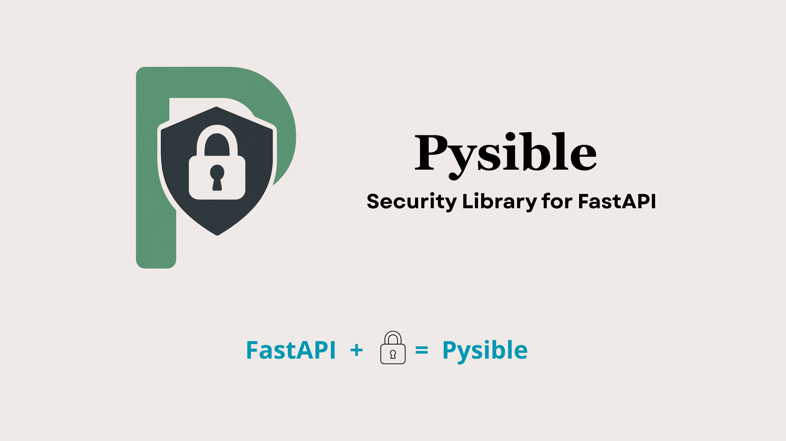

**<p align="center">📌 Pysible – Security Library for FastAPI</p>**

Pysible is an open-source security library for FastAPI applications.
It provides plug-and-play security features like authentication, authorization, API rate limiting, and logging with minimal boilerplate.

---
👉 Install directly from PyPI: 
```
pip install pysible
```
---
🚀 Features:

🔑 JWT Authentication – Easy login/logout with token-based security.

🛡 RBAC (Role-Based Access Control) – Fine-grained access control for endpoints. ** requires Redis **

⚡ API Rate Limiting – Protect APIs from abuse using Redis-powered rate limiting. ** requires Redis **

📝 Logging System – Store logs at different levels (INFO, DEBUG, ERROR, etc.) in files for better observability.

⚙️ Plug-and-Play – Import features and add to endpoints via FastAPI’s Depends.

---
👉**Now follow this docs step-by-step from this point for better understanding**

🔧 **Usage**

After installing pysible, from your desired directory run --> ( in your terminal/powershell )
```
pysible action
```
This will ask for few terminal based prompt like ->
```
Project Name:->:
Redis is running now? (yes/no):->:
Host of Redis (e.g 'localhost' if running locally):->:
Port of Redis:->:
Redis DB Number (e.g '0', '1'):->:
```
---
⚠️ **Important Note** 

Pysible requires a **running Redis instance** on your machine.  
It will automatically try to connect with redis using the provided **Redis HOST** and **PORT**.  
 
If Pysible is unable to connect to Redis, you may encounter errors such as:  
```
❌ redis.exceptions.ConnectionError: Error 111 connecting to localhost:6379. Connection refused.
```
```
✅ Make sure Redis is installed and running before starting your FastAPI app with Pysible.
```
---
📂 Project Structure (Example): If everything goes well, Pysible will make this for you.
```
my_fastapi_app/                  # Your FastAPI project
│── src/                         # Create your endpoints and main.py in this directory
│
│── static/                      # Optional: static files (images, docs, assets)
│
│── tests/                       # Test cases for your app
│
│── requirements.txt             # Project dependencies
│── .env                         # Environment variables (Redis HOST, PORT, JWT secret, etc.)
│── README.md                    # Project documentation
│── .gitignore                   # Ignore venv, cache, logs
│── LICENSE                      # License file (if open source)
```
---

**ℹ️First Step ( Optional but recommended )**

1- Pysible gives you the option to load dummy data into your redis db for testing purpose.<br/>

2- While not required, this step provides a ready-to-use setup so you can start experimenting immediately—no need to define custom users or roles upfront.<br/>

3- Dummy Data Format-<br/>
```
Default User - { "user_id : "DFU1",
                    "password : "unique_password",
                    "roles: : ["root", "admin"]
                    }

Default Roles - "role:root", mapping={"name": "root"}
                "role:admin", mapping={"name": "admin"}
                "role:editor", mapping={"name": "editor"}
                "role:viewer", mapping={"name": "viewer"}
```

**If you want to Load this dummy data**
```
from fastapi import FastAPI, Depends
from pysible.database import Data

app = FastAPI()
Data().load_data()
```
Here in this code we are using **load_data()** function which is coming from **Data** class which we are importing from **pysible.database** module.
**If you want, you can add custom roles and users also the same way as shown below**
```


**ℹ️How to use Pysible Features in your Endpoints**

1. *JWT Authentication (Login & Logout)*


